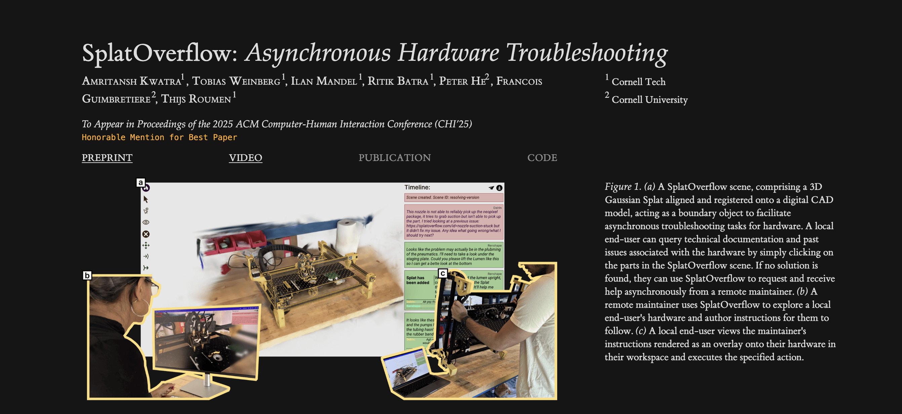

## Tufte Project Template

Generate an elegant research project webpage from a markdown template. This project uses styling from [tufte.css](https://github.com/edwardtufte/tufte-css). **[Here is an example website](https://amritkwatra.com/research/splatoverflow) generated using this template.**

### DISCLAIMER
**This is a template I have duct-taped together for my own use.** _Use it with caution!_ That said, I do hope for others to use this & I will work on requests and review PRs. If you have suggestiosn, please share them.

### Example
Included is a file `sample.md` that is used to generate the [example project page](https://amritkwatra.com/research/splatoverflow) linked above. Assets to generate this webpage are included in the `assets` folder. Examining the structure of this sample could be a useful starting point for making your own website.

#### Screenshots



### Writing
Currently, this template supports a few elements: sections, image figures, video figures, text, code snippets, sidenotes.

#### Sections & Text
You can create a new section using the following:

```md
## Section Name
Text that is part of this very interesting section
```

#### Figures
To create a figure, insert the following html tag into the markdown file:

```md
<figure>
    <src>path-to-image-or-video</src>
    <alt>image alt text</alt>
    <caption>image caption</caption>
</figure>
```
The image caption is rendered on the right-hand margin when the window is wide enough, and underneath the figure in narrow aspect ratios (e.g. mobile). 

Depending on the file type specified in src (based on extension) the figure will render an image or video using html `` or `<video>` tags.

#### Sidenotes
One of the nice things about Tufte's layout is extensive use of sidenotes. To make a sidenote in markdown, simply specify the following inline:
```md
Some text that wants to make a <sidenote><text>reference<text><note>Text that explains the reference.<note></sidenote> that helps provide the reader context
```
This renders the inner contents in `<note>` to the sidenote. All numbering should be automatic.

#### Code Snippets 
Code snippets are automatically created from any text within \``` \``` tick marks.

### Frontmatter
To generate the title, author list, affiliations and links the markdown must begin with some frontmatter in the following format:
```md
title: "FunkyName: Actual Title of Paper"
venue: to appear at ACM Conf 2042
authors:
  - name: "Jay Doe"
    affiliation: "University University"
  - name: "Jurgen Doe"
    affiliation: "University University" # note numbering for multiple common affiliations is done automatically. Currently only one affiliation per author is supported.
  - name: "Jose Doe"
    affiliation: "Industry Industry"
  - name: "Jamie Doe"
    affiliation: "University University"
preprint: https://link-to-arXiv
video: https://link-to-video
publication: null # note null values will appear greyed out
code: null  # note null values will appear greyed out
```
The frontmatter generates the first elements on the page. This project uses [python-frontmatter](https://github.com/eyeseast/python-frontmatter) to do this.

### Generating HTML

First set up your python environment. I prefer using [uv](https://docs.astral.sh/uv/). Use `uv sync`, or use pip to install [marko](https://marko-py.readthedocs.io/en/latest/index.html) & [python-frontmatter](https://github.com/eyeseast/python-frontmatter).

To generate run `uv run scripts/generate.py <path-to-markdown>` this will generate an html file with the same name as the markdown file. To override, pass the filename using `--name`, i.e. `uv run scripts/generate.py <path-to-markdown> --name output` 

### CSS

The styling for generated web pages is in `style/tufte.css` based on a slightly modified stylesheet from [tufte-css](https://github.com/edwardtufte/tufte-css). Modifying this will allow you to make adjustments to the resulting webpage. Look at the tufte-css website to see how this is structured.