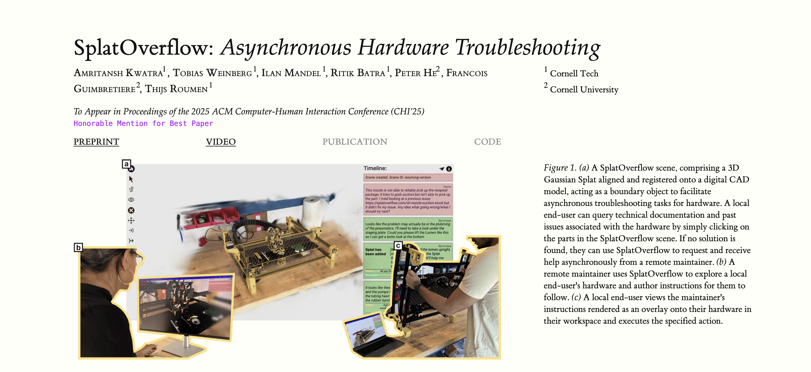
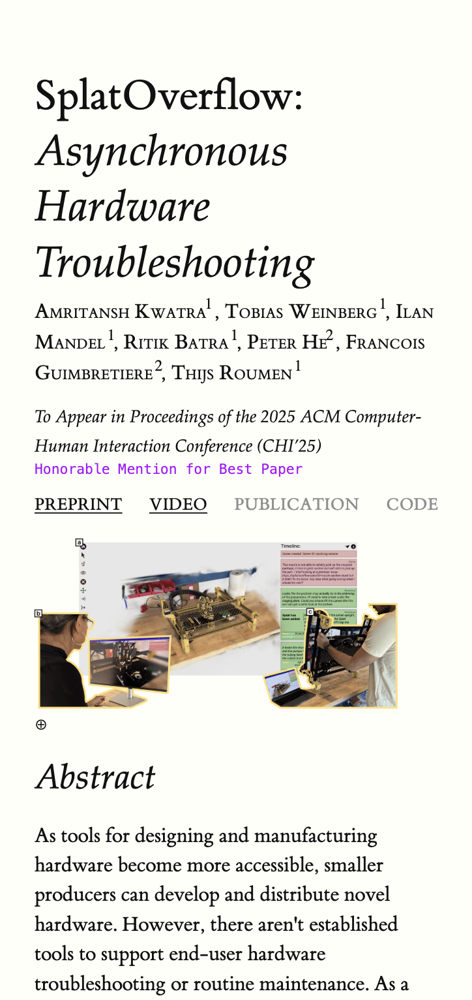
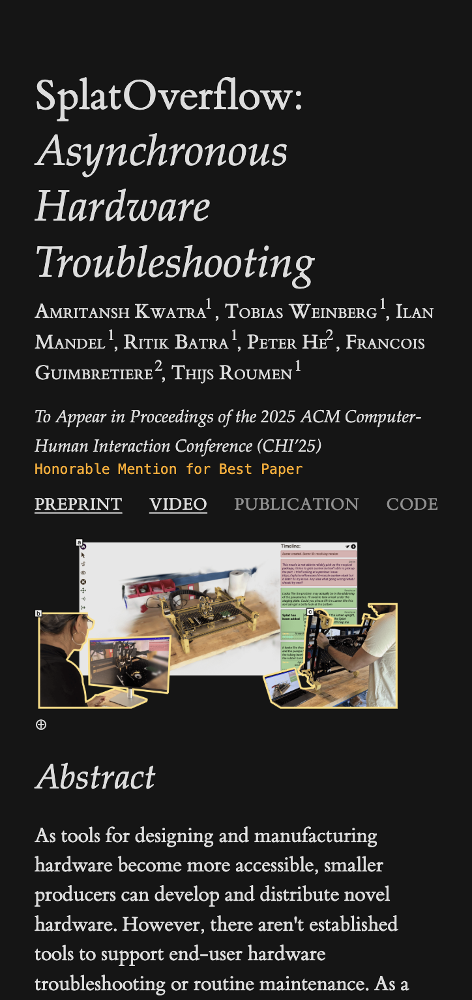
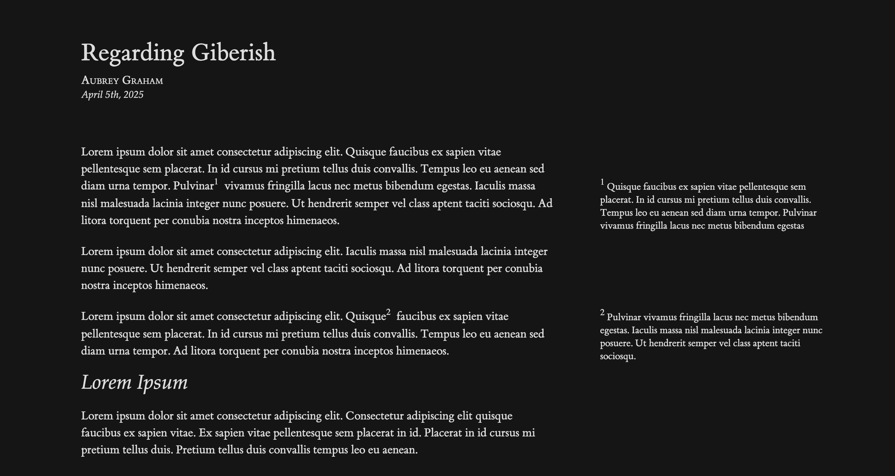
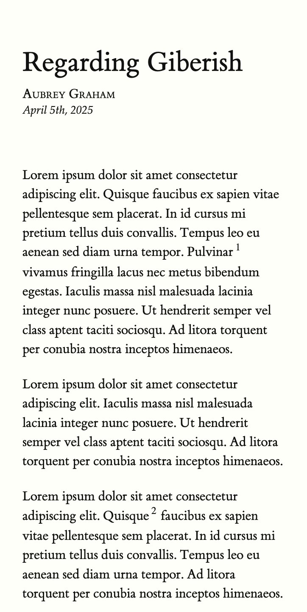

## Project Page Screenshots

### Desktop

**Light Mode Project Page:**

**Dark Mode Project Page:**

### Mobile

**Mobile Project Page (Light | Dark)**

## Blog Screenshots

### Desktop

**Light Mode Blog Page:**

**Dark Mode Blog Page:**

### Mobile

**Mobile Blog Page (Light | Dark)**

